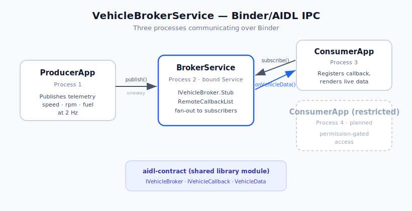

# VehicleBrokerService

A multi-process Android IPC system built on **Binder** and **AIDL**, demonstrating a publish/subscribe telemetry broker pattern as used in Android Automotive OS (AAOS) platform development. A producer app streams synthetic vehicle telemetry into a central broker service, which fans the data out to subscribed consumer apps across process boundaries.



## Overview

Three independent apps (three separate processes) communicate entirely over Binder:

- **BrokerService** — a bound `Service` exposing an AIDL interface. Receives telemetry from the producer and broadcasts it to all registered consumers. Manages subscribers with `RemoteCallbackList` to safely handle consumer processes that die without unsubscribing.
- **ProducerApp** — binds to the broker and publishes vehicle telemetry (speed, RPM, fuel) at 2 Hz. Currently generates synthetic data; designed to be fed by a native IPC daemon as the real source.
- **ConsumerApp** — binds to the broker, registers a callback, and renders live telemetry pushed back across the Binder boundary.

The AIDL contract is isolated in its own library module (`aidl-contract`), shared by all three apps — mirroring how an IPC interface is treated as a standalone, versionable contract in platform work.

## Key Concepts Demonstrated

- **AIDL interface design** — separate interfaces for the service (`IVehicleBroker`) and the consumer callback (`IVehicleCallback`), plus a hand-implemented `Parcelable` (`VehicleData`) showing explicit marshalling across the boundary.
- **Bidirectional Binder communication** — client→server calls (subscribe/publish) and server→client push (the broker invoking consumer callbacks).
- **`oneway` semantics** — `publish` and the data callback are fire-and-forget so a slow consumer cannot stall the broker's fan-out.
- **Threading correctness** — consumer callbacks arrive on a Binder thread pool thread; UI updates are posted back to the main thread.
- **Subscriber lifecycle** — `RemoteCallbackList` with `beginBroadcast`/`finishBroadcast` and dead-client handling.
- **Cross-app binding** — explicit `ComponentName` binding with Android 11+ package visibility (`<queries>`) declarations.

## Project Structure

```
VehicleBroker/
├── aidl-contract/                    # Android library — the shared IPC contract
│   └── src/main/
│       ├── aidl/com/abmax777/vehiclebroker/contract/
│       │   ├── IVehicleBroker.aidl   # service interface (subscribe/unsubscribe/publish)
│       │   ├── IVehicleCallback.aidl # consumer callback (oneway data push)
│       │   └── VehicleData.aidl      # parcelable declaration
│       └── java/com/abmax777/vehiclebroker/contract/
│           └── VehicleData.kt        # hand-written Parcelable payload
│
├── app/                              # BrokerService (hosts the bound service)
│   └── src/main/java/.../BrokerService.kt
│
├── producer/                         # ProducerApp (publishes telemetry)
│   └── src/main/java/.../MainActivity.kt
│
└── consumer-full/                    # ConsumerApp (receives + displays telemetry)
    └── src/main/java/.../MainActivity.kt
```

## Setup & Run

### Prerequisites
- Android Studio with an AAOS emulator (API 34, Automotive 1408p landscape, arm64)
- ADB in system PATH

### Build & install all three apps
```bash
./gradlew :app:installDebug :producer:installDebug :consumer-full:installDebug
```

### Run the chain
1. Launch **ConsumerApp** first (it binds and subscribes).
2. Launch **ProducerApp** and tap **Start Publishing**.
3. Observe live telemetry updating in the consumer.

### Watch the IPC over logcat
```bash
adb logcat -c && adb logcat -s BrokerService:D Producer:D Consumer:D
```
You should see the producer publishing, the broker fanning out to N subscribers, and the consumer receiving each sample.

## Roadmap

- [ ] Permission-gated access — a second `consumer-restricted` app and a custom permission demonstrating access control on the IPC channel
- [ ] Cross-Binder RTT benchmarking (P50/P95/P99 latency across the boundary)
- [ ] Wire the native Linux-to-Android IPC daemon as the producer's real data source
- [ ] Foreground-service hardening so the producer survives backgrounding on real devices

## Why This Project

Built to demonstrate end-to-end Binder/AIDL IPC across multiple processes — the core communication mechanism behind Android framework services and AAOS platform components. It complements the companion [linux-android-ipc-daemon](https://github.com/Abmax777/linux-android-ipc-daemon) project, which covers the native Linux-to-Android socket layer; together they span the native HAL layer up through framework-level service IPC.
